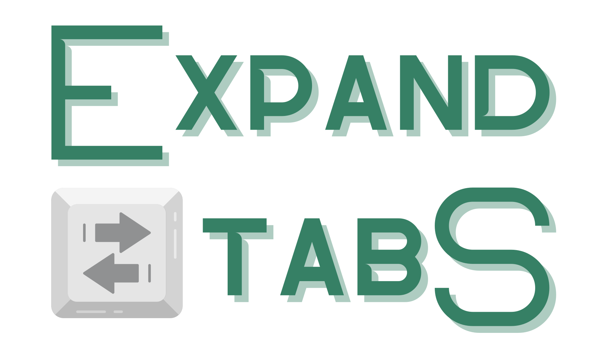

<div align="center">
  
  <h1>Expand Tabs</h1>
  <p><a href="/docs/README-EN.md">English</a></p>
  <p><a href="https://github.com/BarudakRosul/expand-tabs/issues/new?assignees=&labels=bug&projects=&template=bug_report.yml">Report Bug</a> · <a href="https://github.com/BarudakRosul/expand-tabs/issues/new?assignees=&labels=enhancement&projects=&template=feature_request.yml">Request Feature</a></p>
  <p>
    <a href="https://github.com/BarudakRosul/expand-tabs/actions/workflows/test.yml"></a>
    <a href="https://npmjs.com/package/@barudakrosul/expand-tabs"></a>
    <a href="/LICENSE"></a>
    <a href="https://npmjs.com/package/@barudakrosul/expand-tabs"></a>
    <a href="https://github.com/BarudakRosul/expand-tabs/stargazers"></a>
    <a href="https://github.com/BarudakRosul/expand-tabs/network/members"></a>
    <a href="https://github.com/BarudakRosul/expand-tabs/issues"></a>
  </p>
  <a href="https://techforpalestine.org/learn-more"></a>
</div>

## Table of Contents

1. [Introduction](#introduction)
2. [Features](#features)
3. [Installation](#installation)
4. [Usage](#usage)
5. [Contribution](#contribution)
6. [License](#license)
7. [Acknowledge](#acknowledge)
8. [Donate](#donate)
9. [Changelog](#changelog)

## Introduction

Expand Tabs is a JavaScript extension that converts tab characters (`\t`) in strings into spaces of a specified length. It is made as similar as possible to `expandtabs()` in Python.

## Features

Expand Tabs offers the following features:

- Replaces a tab character in a string with any number of spaces.
- Allows setting the tab size as needed.
- Can be integrated into TypeScript code.

## Installation

To install Expand Tabs locally, follow these installation steps:

```shell
npm install @barudakrosul/expand-tabs
```

## Usage

To start using Expand Tabs, import the module first:

**1\. CommonJS**
```javascript
require("@barudakrosul/expand-tabs");
```

**2\. ESM (ECMAScript Modules)**
```javascript
import "@barudakrosul/expand-tabs";
```

**3\. TypeScript**
```typescript
import "@barudakrosul/expand-tabs";
```

Example of usage:

```javascript
let text = "Name\tAge\tLocation\nAlice\t30\tWonderland";
console.log(text.expandTabs());

// Result:
// Name    Age     Location
// Alice   30      Wonderland
```

```javascript
let text = "Name\tAge\tLocation\nAlice\t30\tWonderland";
console.log(text.expandTabs(12));

// Result:
// Name        Age         Location
// Alice       30          Wonderland
```

## Contribution

Contributions to Expand Tabs are greatly appreciated! Whether reporting bugs, suggesting new features, or contributing to code improvements.

## License

Expand Tabs is licensed under the Apache-2.0 License - see the [LICENSE](/LICENSE) file for details.

## Acknowledge

Expand Tabs appreciates the support and contributions of the following individuals and open source projects:

- [@FajarKim](https://github.com/FajarKim) - Lead developer and creator of the application.
- Open source community - For valuable contributions to the tools and libraries used in this project.

## Donate

We really appreciate your support to continue developing this project. If you find this project useful, you can support us with a donation:

[](https://ko-fi.com/barudakrosul)
[](https://trakteer.id/barudakrosul)

Every donation, no matter the amount, means a lot to us. Thank you for your support! ❤️

## Changelog

Keep up with the latest changes and updates of Expand Tabs by referring to [Changelog](https://github.com/BarudakRosul/expand-tabs/releases).

Thank you for choosing Expand Tabs! We aim to provide an easy solution to replace tabs in strings with spaces as needed.

[](https://techforpalestine.org/learn-more)
